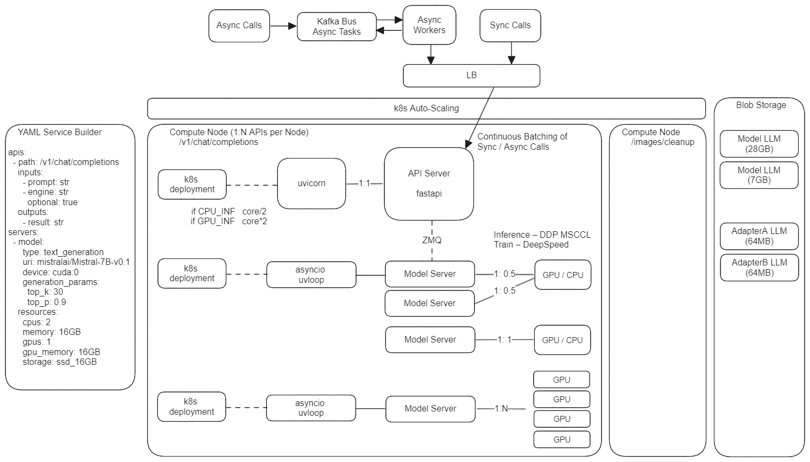

# kFastML

Goal: One line command for YAML --> Inference Sever generation, docker image
build and k8s deployment.

### Architecture:

### Why?

- Easy serving and training of diverse ML pipelines
- Horizontal Scalability and Stability with k8s (deploy and forget)

### TODOs:

- Support continuous batching (per-iteration)
- For LLM, we use flash-attn-v2 but need to check KV_Cache implementation

### Minors:

- Wait model_server before REST API available
- Support api_server to N-models router (for multi-engine support)